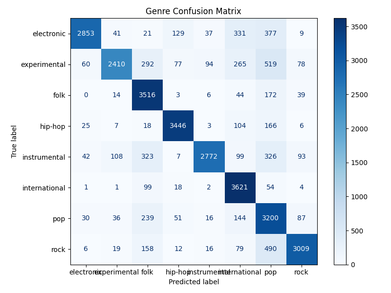
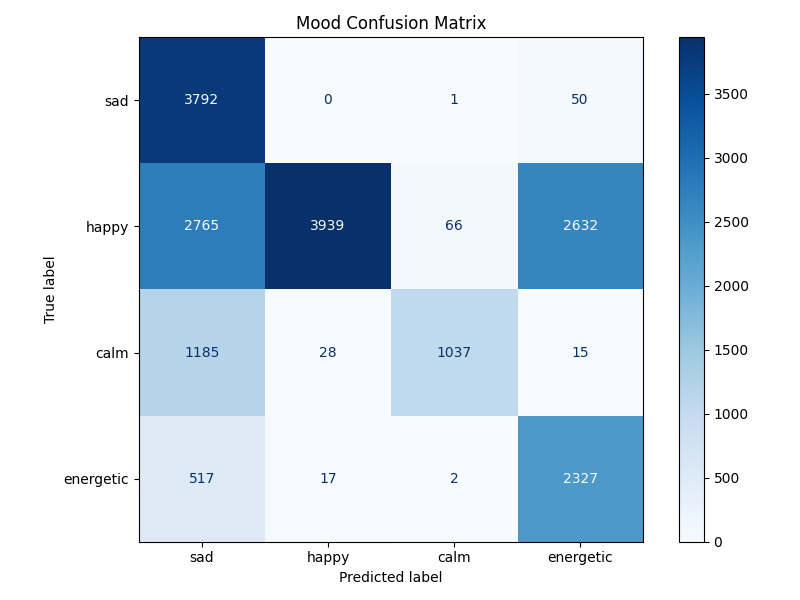
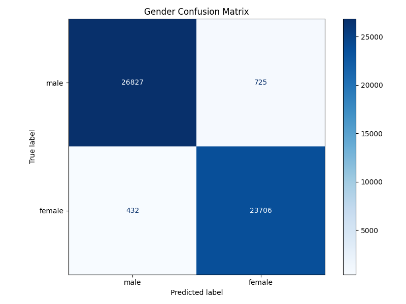

# A Multi-Head CNN Framework for Music Genre, Mood and Singer Gender Classification

## Overview

This project presents a CNN-based framework for classifying music according to:

- Music Genre
- Music Mood
- Singer Gender

A common CNN architecture is used for the three classification tasks, with separate task-specific model instances trained on their respective datasets.

The system converts raw audio into Mel spectrograms and uses a convolutional neural network to learn temporal and spectral features for classification.

## Architecture

The CNN consists of:

- Convolutional layers
- Batch normalization
- ReLU activation
- Max pooling
- Adaptive average pooling
- Fully connected layer
- Dropout
- Task-specific classification heads

The three classification tasks are trained independently using their corresponding datasets.

## Audio Preprocessing

The audio preprocessing pipeline consists of:

1. Resampling audio to 22.05 kHz
2. Splitting audio into 5-second clips
3. Generating 128-bin Mel spectrograms
4. Converting the spectrogram to decibel scale
5. Normalizing the spectrogram
6. Saving the processed features for model training

## Datasets

Three datasets are used for the classification tasks:

- FMA — Music Genre Classification
- DEAM — Music Mood Classification
- Custom dataset — Singer Gender Classification

The datasets are **not included in this repository**.

## Training

The models were implemented using PyTorch.

Training configuration:

- Optimizer: Adam
- Learning rate: 0.001
- Epochs: 50
- Loss function: Cross-Entropy Loss
- Batch size: 32
- GPU acceleration: CUDA

## Results

| Task | Accuracy | Precision | Recall | F1 Score |
|------|----------|-----------|--------|----------|
| Genre | 81.87% | 0.8443 | 0.8187 | 0.8202 |
| Mood | 60.39% | 0.7897 | 0.6039 | 0.6000 |
| Gender | 97.76% | 0.9777 | 0.9776 | 0.9776 |

## Confusion Matrices

### Genre



### Mood



### Gender



## Prediction

To predict the genre, mood and singer gender of an audio file:

```bash
python src/predict.py